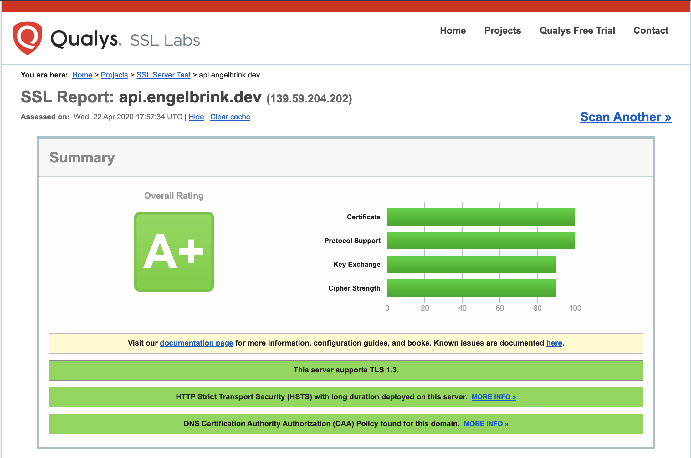
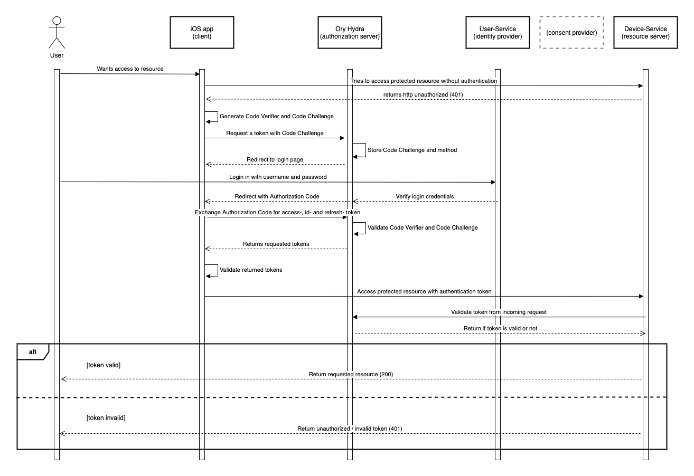

# se09-docs

This repository contains all information about my IoT project for the SE09 module. The project is a base setup for an IoT application where users can control their smart devices via an smartphone app. Furthermore all logs/events from each IoT device should be stored into a database. A user can can signup & login via the iOS app. After that he can claim an IoT device (washing machine) and configure it to connect to his local Wifi via the iOS app. After that his device is connected to the MQTT broker and he can change settings/read status of the device with his smartphone via MQTT.

In the future it should also be possible that service technicans can get access to data of the devices of their customers to to remote maintenance. This needs to be allowed explicitly by the owner of the device.

## List of repos
- [user-service](https://github.com/henrikengelbrink/se09-user-service)
- [cert-service](https://github.com/henrikengelbrink/se09-cert-service)
- [device-service](https://github.com/henrikengelbrink/se09-device-service)
- [infrastructure](https://github.com/henrikengelbrink/se09_infrastructure)
- [user-app](https://github.com/henrikengelbrink/se09-user-app)
- [docker-images](https://github.com/henrikengelbrink/se09-docker-images)
- [hibp-service](https://github.com/henrikengelbrink/se09-docker-images/tree/master/hibp)
- [iot-device](https://github.com/henrikengelbrink/se09-iot-device)

## Architecture

## Threat modelling

Table of all possible threats/attack vectors can be found here: https://airtable.com/embed/shr0tufoYRPPDTZJf?backgroundColor=red&viewControls=on

## General principles
!!! TODO

# Kubernetes security
Kubernetes is the biggest container orchestration tool out there and it is used by a lot of companies from small startups to huge enterprise. Nevertheless, the default configuration of Kubernetes is pretty insecure. In the following I will explain possibilities to increase security of Kubernetes.

## Network policies
By default all pods in a namespace can communicate with each other, independent whether it is necessary or not. This is a security issue, because if one pod is vulnerable, it's possible to access all other pods. If we limit the network capabilities to the minimum, we can reduce the impact of one vulnerable pod. I'm blocking [all network connections between pods by default](https://github.com/henrikengelbrink/se09_infrastructure/blob/master/L2_InfrastructureConfig/k8s.tf#L11-L20) and enable them manually where it is necessary. The policies are automatically enforced by Kubernetes on layer 4 of the internal network. The entire configuration of all policies can be found [here](https://github.com/henrikengelbrink/se09_infrastructure/blob/master/L3_Services/network-policies.tf).

## Pod security policies
By default all pods in a Kubernetes cluster can start with root priviledges and as root user, even if it's not neccessary for these pods. If one of these pods is vulnerable, the attacker can get access to the entire k8s cluster. To prevent this, it is possible to define pod security policies for a Kubernetes cluster. These policies define some rules for pods which are started in the cluster, for example it is possible to define that pods cannot start in priviledged mode or as root user. I defined a [simple pod security policy](https://github.com/henrikengelbrink/se09_infrastructure/blob/master/L3_Services/crds/psd.yml) which is preventing pods starting with priviledges or a root user. This is only a simple starting point and there are a lot of possible configurations available, but for the beginning this simple policy already helps to make the cluster more secure.

- https://banzaicloud.com/blog/pod-security-policy/
- https://docs.bitnami.com/kubernetes/how-to/secure-kubernetes-cluster-psp/

## Secret management
All the secrets/certificates that needs to be injected in some backend services are managed by Hashicorp Vault. Hashicorp Vault is a tool which is basically meant to store and protect sensitive data. All the secrets are encrypted and stored by Vault and automatically injected into the corresponding services by an agent which needs to be defined in the YML file of the deployment, [like in this config file for the VerneMQ MQTT broker](https://github.com/henrikengelbrink/se09_infrastructure/blob/master/L3_Services/vernemq.tf#L56-L73). 

Hashicorp Vault itself can be sealed/unsealed. In the sealed mode it is not possible to get any data from it. The unseal process is based on Shamir's Secret Sharing algorithm. The basic idea of this algorithm is to split an unseal secret into multple pieces and to unseal Vault you need for example three of five of these keys. I'm using the automatic unseal feature of Vault together with the Google Cloud Key Management Service where these additional keys are stored into Google Cloud and the seal/unseal process is automatically done by Vault.

- https://www.vaultproject.io/docs/concepts/seal
- https://learn.hashicorp.com/vault/operations/autounseal-gcp-kms

## Mutual TLS
By default all the traffic between pods/services is not encrypted. Services meshes are one easy possibility to implement mutual TLS between all services. In general services meshes are adding another layer on top of Kubernetes. There are three bigger solutions for Kubernetes: [Linkerd](https://linkerd.io/), [Consul](https://www.consul.io/) and [Istio](https://istio.io/). All of them offer the possibility to implement mutual TLS, but I decided to use Istio because it also offers other functionalities which will be presented later in this document. 

Setting up Istio to use mutual TLS is pretty easy, you only have to install Istio to the cluster and enable mutual TLS in the config. Istio is setting up Envoy proxies in front of every service and it automatically creates certificates which will be used to terminate the traffic between services within each Envoy proxy.

  

# Network security

## Cloud Firewall
The infrastructure of this project is running on DigitalOcean. Every managed Kubernetes cluster at DigitalOcean comes automatically with an preconfigured Cloud Firewall which automatically blocks traffic for all ports to the Droplets (Nodes/VM's) except the ports which are necessary to run Kubernetes. The firewall is configured in a way that it only allows traffic which comes from the internal private cloud network of all nodes of the cluster. This cloud firewall prevents hacker to directly access any node of the Kubernetes cluster. All incoming traffic from outside is routed through the load balancer which is connected to the Ambassador Edge Stack service any Ory Oathkeeper.

## Ambassador Edge Stack with TLS
The Ambassador Edge Stack is one of many possible solutions for Kubernetes API gateways. Ambassador is a software which is provisioned via Helm chart into the Kubernetes cluster. Ambassador is working as a Kubernetes ingress, this means it define all possible routes into the cluster itself. Internally the managed DigitalOcean cluster spins up a load balancer at DigitalOcean which recievces all the traffic and routes it to the Ambassador service. Ambassador is routing the requests depending on the specific sub-domain the the corresponding service in the Kuberentes cluster. 

Furthemore Ambassador is also terminating TLS. Therefore it is using the cert-manager and Let's Enrypt to autmatically provision and update TLS certificates for all domains. Through TLS the entire communication via HTTPS between the clients and the server is encrypted.

## Ory Oathkeeper
Ory Oathkeeper is a cloud-native identity & access proxy which is written in Go and completely open source. All incoming API requests for the backend (*https://api.engelbrink.dev* ) are routed from Ambassador Edge Stack to Ory Oathkeeper. Based on a [JSON configuration file](https://github.com/henrikengelbrink/se09_infrastructure/blob/master/L3_Services/oathkeeper-rules.json) Ory Oathkeeper routes the traffic to the corresponding service. The configuration file defines each route and furthermore you can configure authentication, authorization and mutators for each route. 

By using Ory Oathkeeper there is only a single point where all the API endpoints are made public and secure. Every new endpoint needs to be explicitly defined in the configuration which eliminates the danger of publishing endpoint accidentially. Furthermore the authentication and authorization only needs to be implemented in Ory Oathkeeper and not in every single service. This reduces complexity and makes it easier to keep an overview of the entire backend and all public routes. The points authentication and authorization will be explained under *Application security* in a more detailed way.

## VPN to restrict access (DB/k8s)
Some endpoints and services should not be available for everyone in public, for example the endpoint where we create new IoT devices in our device-service or the access the PostgreSQL cluster. For these use-cases I have setup an OpenVPN server at DigitalOcean and the endpoint for creating devices (tbd.) and the [PostgreSQL cluster](https://github.com/henrikengelbrink/se09_infrastructure/blob/master/L2_InfrastructureConfig/db.tf#L29-L33) are only accessible through the VPN. This reduces the risk of unauthorized access to these resources.

## DNS security / TLS

In order to increase the DNS security I've implemented and configured the following things:

### Add CAA record
CAA (Certificate Authority Authorization) records specify which certificate authorities are permitted to issue certificates for a specific domain. They help to reduce the risk of unintended certificate mis-issue.

### Only TLS v1.2 and v1.3
The Ambassador Edge Stack only supports TLS v1.2 and TLS v1.3 and older versions are not supported, because they are not considered secure enough anymore.

### Specific cipher suites
In general cipher suites describe which algorithms are used to encrypt network communication between clients. In TLS version up to 1.2 these algorithm sets were defined for key exchange, block cipher and message authentication. In TLS 1.3 a lot of legacy algorithms were dropped out and the strucutre changed a little bit which results in an even more secure protocol. By default, the Ambassador Edge Stack supports a lot of cipher suites including some which are considered insecure. In order to increase the security I only allow one of the following cipher suites:

TLS 1.2
- TLS_ECDHE_RSA_WITH_AES_256_GCM_SHA384
- TLS_ECDHE_RSA_WITH_CHACHA20_POLY1305_SHA256
- TLS_ECDHE_RSA_WITH_AES_128_GCM_SHA256

TLS 1.3
- TLS_AES_128_GCM_SHA256
- TLS_AES_256_GCM_SHA384
- TLS_CHACHA20_POLY1305_SHA256

### HTTP Strict Transport Security (HSTS)
HSTS is a mechanism which helps to mitigate man-in-the-middle attacks in network communication. HSTS means that the server sends an additional header to the client which inform the client that only encrypted HTTPS connections are allowed.

### Domain Name System Security Extensions (DNSSEC)
DNSSEC is a list of different standards which helps to increase the DNS security by enusring authenticity and integrity of the DNS sources. Unfortuentely DigitalOcean doesn't provide these functionalities, so if this would be an obligatory measure for the project it is necessary to change the cloud provider.

 
All of these steps helped me to increase the DNS/TLS security which results in a A+ ranking at SSLLabs:

- https://www.thesslstore.com/blog/cipher-suites-algorithms-security-settings/
- https://github.com/ssllabs/research/wiki/SSL-and-TLS-Deployment-Best-Practices

  

# Application security

## Authentication through Oathkeeper & Hydra

### OAuth2.0 protocol (Authorization Code Flow with PKSE for iOS)
Authentication for the entire system is based on the OAuth2 protocol. The OAuth2 protocol offers different types of grants which deliver the access token to the client. Depending on the client type there are different ways to handle to access token exchange. I decided to use the Authorization Code Flow with PKSE because the user is interacting via the native iOS app and this flow is the most secure for a native smartphone app. 

During the Authorization Code Flow, the client is generating a secure random code verifier and a hashed code challenge. The code challenge is put into an request which is send to the authenticaion server to initialze the authentication session. The authenticaion server persists the code challenge, the requested audience and the client identifier for the life time of the login session. After that, the authenticaion server redirects the user an web-based user interface where he can enter his credentials. By submitting the login form in the UI, the user sends the entered credentials back to the authenticaion server where the credentials are verified. If the credentials are valid, the user is redirected to the redirect uri with the authroization code in the URL. The client app uses this authorization code and the code verifier to request the tokens from the authentication server. These tokens can then be used to access some API's.

The authentication flow I'm using at the moment is not entirely OAuth2 compliant because I'm skipping the consent provider flow, where the users is authorizing each aplication specifc access to his data. I've done this, because in the beginning it's only my service who is accessing the data and if a user want to signup/login into my application, he already showed the intention to provide his data. In the future I'm planning to integrate with other services or give access to other third parties and in this case the consent provider needs to be included into the flow.

### Ory Hydra
The entire OAuth2 is pretty complex and implementing every detail by yourself requires a lot of knowledge and time and even the smallest problem can cause huge vulnerability issues. For this reason, I decided to use an already existing solution. There are a lot of possibilites out there, e.g. SaaS solutions like Auth0 and Okta or open source projects like KeyCloak or Ory Hydra. I decided not to choose a proprietary SaaS because this results in a vendor lock-in. 

During my research, I found some open source projects which are offering solutions for Identity and Access Management (IAM) but most of them were complex to configure and setup and others were not realy cloud native. Fortunately, I've found the [Ory project](https://www.ory.sh/) and they offer four different solutions in the space of IAM which are easy to configure and completely cloud native. I've decided to go with Ory Hydra which is a OAuth2 and OpenID Connect server for secure access to applications and API's. All the heavy work like verifiying codes/challenges and issuing tokens are done by Hydra, only the user management itself needs to be done by yourself. They are also offering a solution for this, Ory Kratos, but it wasn't out of beta when I started the project, so I decided to implement the user management by myself.

### User-service
Thre user-service itself is a Kotlin application using the Micronaut framework. All the user data is stored in a Postgres database. The user-service has two major functionalities. The first part is serving the HTML files which are shown to the user during registration/login. The second part are the logic to store users and their credentials encrypted in the database and verify user-entered credentials during the login. Therefore, the user-service is closely connected to the Hydra service and during every signup/login there is a lot of communication between Ory Hydra and the user-service.

### Ory Oathkeeper
Every incoming request to any API is going through the Ory Oathkeeper proxy. Every API route is defined in the [JSON configuration file](https://github.com/henrikengelbrink/se09_infrastructure/blob/master/L3_Services/oathkeeper-rules.json). If a specific route is only accessible for authenticated users, Ory Oathkeeper checks whether the request contains the authorization header with the Token and if this is the case, it validates the token by calling the introspect endpoint of Ory Hydra. This functionality is easyily configureable in the config file, which is a huge benefit of the Ory project.

 

**Detailed UML sequence diagram of the authentication flow:**

## Authorization
Besides authentication, authorization is a important point in application security. Authentication is used to make sure that a requesting user is known and validated by my system, whereas authorization is checking whether the user who requests some resource is allowed to access this specific resource. It is a common problem in applications, that it's possible to get access to resources of other users in cause of bugs in the authorization process.

At the moment I've implemented the authorization logic into each service I've implemented. For example if an authenticated user is requesting data for a specific device at */devices/device-id-abc-123*, I'm explicitly checking whether the user is the owner of the device. By implementing this for every single endpoint explicitly, it's very easy to make mistakes and forget about this, which immediately results in an vulnerability. Writing tests can help to prevent deploying these vulnerabilities to a production system, but it's still possible.

A better solution would be to use a specific access control server which is connected to the Ory Oathkeeper proxy to automatically check these things for every incoming request. This will result into one single service where all the configurations need to be implemented. The Ory project is offering a service called Keto for this, but it is still in beta status and a lot of functionalities are still missing, but in the future this would be the way I would handle authorization. Keto is supposed to use access control patterns like Role-Based-Access-Control (RBAC), Attribute-Based-Access-Control (ABAC) or Access-Control-Lists (ACL).

## bcrypt for salted and hashed passwords
It is a common problem that there are still applications and services which store password into the database in plaintext which means as soon a hacker get access to a database, he is able to read and use all the user passwords. Even if this is a problem since the beginning of the internet and every developer should know about this, you can read about data leaks with plaintext passwords weekly.

I deciced to use the bcrypt algorithm to hash and salt the passwords I'm storing in the database with my user-service. Bcrypt is using a random and securely generated Salt which is added to the hash of the acutal password. This makes it impossible for the attacker to use Rainbow/lookup tables to crack the password. Furthemore bcrypt is using an algorithm which makes the hash-function slower. This makes brute forcing millions of passwords nearly impossible (until the hacker has a lot of computational power) because it would take too much time.

- https://auth0.com/blog/hashing-in-action-understanding-bcrypt/

## HaveIBeenPwned service
The developer Troy Hunt started a project called [*HaveIBeenPwned*(https://haveibeenpwned.com/) where he basicaly collects data from password leaks. At the moment the project contains over 550 million leaked passwords. It is common that hacker are using data from prior leaks and use them to get access in other services with this data or they are using these very common passwords to brute force other services. As a developer you can use the data of *HaveIBeenPwned* and check every new user password against this data collection and if the new password of the user appears in *HaveIBeenPwned* you can tell him to use another password.

I've downloaded the entire HIBP data as a CSV file, created an bloom filter out of it and implemented a REST API which uses this bloom filter to check if a password was already leaked. On every new user registration, [the user-service is checking](https://github.com/henrikengelbrink/se09-user-service/blob/master/src/main/kotlin/se09/user/service/services/UserService.kt#L29-L31) the password of the user with the [hibp-service](https://github.com/henrikengelbrink/se09-docker-images/tree/master/hibp).

- https://haveibeenpwned.com/
- https://github.com/willf/bloom

## SQL injections
SQL injections are nothing I have to actively care about in this project because I'm using an ORM in all services that are using some SQL. I'm not writing any SQL statements because the ORM is building all the queries and it also takes care about escaping queries to prevent SQL injections.

- https://owasp.org/www-community/attacks/SQL_Injection

## Cross-Origin Resource Sharing (CORS)
CORS is way to restrict which web services with a different host can access your backend. By default, a web app like `https://example-a.com` can't reach a backend `https://api-b.com` because of the same origin policy which is applied. In order to allow a request like this, you have to define specific CORS header in the backend so that the web app is able to request data from the backend. At the moment I've only implemented the iOS app which is communicating to my backend services and there is no webapp which is running in a browser, so there is no need to define these CORS configurations. If this is going to change in the future, I would add these configurations in the Ambassador Edge Stack configuration. In this configuration I can define headers which should be added to each response which is going back to the client from the backend.

- https://auth0.com/blog/cors-tutorial-a-guide-to-cross-origin-resource-sharing/
- https://www.codecademy.com/articles/what-is-cors

## Cross-Site-Request-Forgery (CSRF)
As soon as the user logged into you application, you can store the login state into a cookie. This cookie is send with every request to the backend in order to authenticate the user so that he only needs to login once for a specific time range. This can be abused by an attacker. The attacker can implement his own site where he is executing an unintended request  from his site to your backend. This happens without the user knowing about it and because of the existing cookie, the request can potentially result in some (eval) changes in the backend. To prevent this kind of attack, you can add a CSRF token to every webpage which is additionally send with each request to the backend an then validated in the backend.

At the moment I'm only using the iOS application and the internal UIWebView/WKWebView I'm using doesn't store any cookies and is totally sandboxed, so it's not possible that any third-party is executing unintended requests with some stored cookies.

- https://auth0.com/docs/protocols/oauth2/mitigate-csrf-attacks

## Cross-Site Scripting (XSS)
XSS attacks are based on the fact, that an attacker is able to inject malicious code into a web application by executing for example JavaScript from input fields. To prevent these kind of attackes it's necessary to validate and escape every user input to be sure that no injected code is executed. 

At the moment I'm only using the iOS application and the login/register views are handled by the AppAuth framework. The AppAuth framework is the only possibility to open these pages and it's not necessary for an attacker to inject some malicious inputs.

- https://auth0.com/blog/developers-guide-to-common-vulnerabilities-and-how-to-prevent-them/#Cross-Site-Scripting--XSS-

  

# IoT security

## MQTT broker
The communication with the Iot devices is handled via the MQTT protocol. MQTT is a protocol which is based on clients that publish/subscribe for specific topics at the MQTT broker which is the central element of the MQTT system where all messages are processed. I'm using the [VerneMQ](https://vernemq.com/) MQTT broker which is written in Erlang and completely open source.

For every new IoT device I'm creating a certificate which is used to authenticate the client whenever he want's to connect to the broker. Furthermore, the client also needs to provide a valid password which is validated in the backend. When a new client connects to the MQTT broker, the broker is checking whether the client certificate is a valid certificate which matches the server certificate. This is handled on OSI layer 4. If the certificate is valid, the [broker sends a request](https://github.com/henrikengelbrink/se09_infrastructure/blob/master/L3_Services/vernemq.tf#L45-L46) to the cert-service. The [cert-service](https://github.com/henrikengelbrink/se09-cert-service/blob/master/src/main/kotlin/se09/cert/service/controller/VerneMQController.kt#L21-L42) uses the credentials and validates the login with the [device-service](https://github.com/henrikengelbrink/se09-cert-service/blob/master/src/main/kotlin/se09/cert/service/ws/DeviceWebService.kt#L18-L30).

The same procedure is also done for every publish/subscribe event. Additionally I'm checking whether the client is allowed to subscribe/publish to the specific login he tries to publish/subscribe.

- https://www.hivemq.com/blog/mqtt-security-fundamentals-wrap-up/
- https://docs.vernemq.com/plugindevelopment/webhookplugins

## Vault PKI / Public-key cryptography
As described in the previous part, everty IoT device gets an certificate which is created in a backend service. The process of creating and signing all the certificates is very complex, so I decided to use an existing solutions for this. Hashicorp Vault which I'm already using for secret management in my Kubernetes cluster also offers the functionality of creating your own Public-Key-Infrastrucure (PKI). I've used this feature to setup my own PKI to handle the certificates for all the IoT devices. The certificates and keys are not stored in Vault, they are copied to the device and not persisted afterwards. The certificate for each device expires after one year and after that time, the certificate needs to be renewed. The new certificate will be updated by the device-service via the Over-the-Air-Update (OTA) with the firmware.

- https://learn.hashicorp.com/vault/secrets-management/sm-pki-engine

## IoT device
I decided to use the ESP32 with Mongoose OS for the IoT device. Mongoose OS is open-source and it offers a lot of functionalities like OTA. The Over-the-Air-Updates are handled by the device-servie and whenever the device gets the message to update itself via MQTT, it is downloading the new firmware via a GET request from the device-service. 

Mongoose OS offers the functionality to encrypt the firmware and all other files on the device. This prevents attackers to reverse engineer the device or steal credentials like the MQTT certificates from the device or manipulate the device, for example during the shipping process. The encryption needs to be enabled via the Mongoose OS CLI which creates and secret key file which is necessary for all future firmware updates. I've unfortunately not implemented this at the moment, but the plan is to store all these encryption keys for each device in Hashicorp Vault where the device-service can access them for future firmware updates.

- https://mongoose-os.com/docs/mongoose-os/userguide/security.md

  

# Mobile security

## AppAuth

## iOS keychain

  

# Database security

## Restrict access by IP and user permissions (least priviledge)

## Backups/Recovery

## Fallback during outtages

  

# Monitoring

## Sentry for crash reporting

## Collect logs with the Elastic stack

## Collect metrics with Prometheus

## Traffic management with Kiali

## Auditing for PostgreSQL

  

# Improvements for the future:
- Container scanning

  

# Useful links:
- https://medium.com/@reuvenharrison/an-introduction-to-kubernetes-network-policies-for-security-people-ba92dd4c809d
- 
- https://www.nexusgroup.com/how-to-validate-certificates-in-iot-devices-5/
- https://quarkus.io/guides/vault
- https://learn.hashicorp.com/vault/secrets-management/sm-pki-engine
- https://www.hashicorp.com/blog/certificate-management-with-vault/
- https://kubernetes.io/docs/tasks/inject-data-application/distribute-credentials-secure/
- https://www.hashicorp.com/blog/injecting-vault-secrets-into-kubernetes-pods-via-a-sidecar/
- http://medium.com/@dav009/terraform-sane-practices-project-structure-c4347c1bc0f1

- https://medium.com/@ScottAmyx/managed-pki-certificates-one-step-at-a-time-toward-securing-the-iot-8b4c539c8ec
- https://cloudinvent.com/blog/howto-hashicorp-vault-ca-pki-deployment/
- https://dev.to/v6/vault-pki-secrets-engine-with-intermediate-signing-authority-hap
- https://medium.com/@sufiyanghori/guide-using-hashicorp-vault-to-manage-pki-and-issue-certificates-e1981e7574e
- http://yet.org/2018/10/vault-pki/
- https://www.davideaversa.it/blog/kotlin-development-in-vscode/
- https://github.com/62726164/bp/tree/master/load
- https://github.com/adewes/have-i-been-bloomed/blob/master/Makefile
- https://github.com/adewes/bloom
- https://developers.shopware.com/developers-guide/csrf-protection
