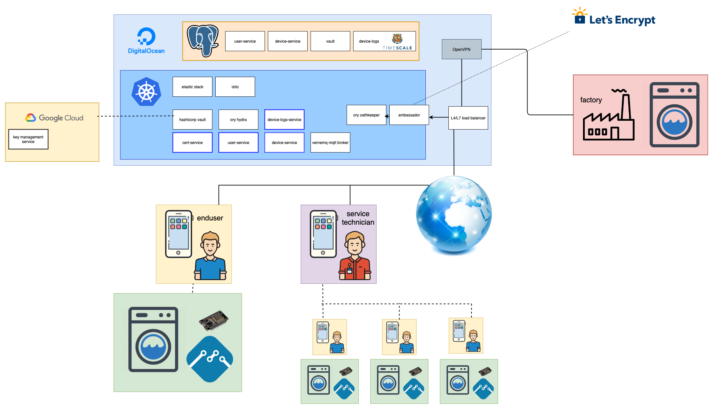
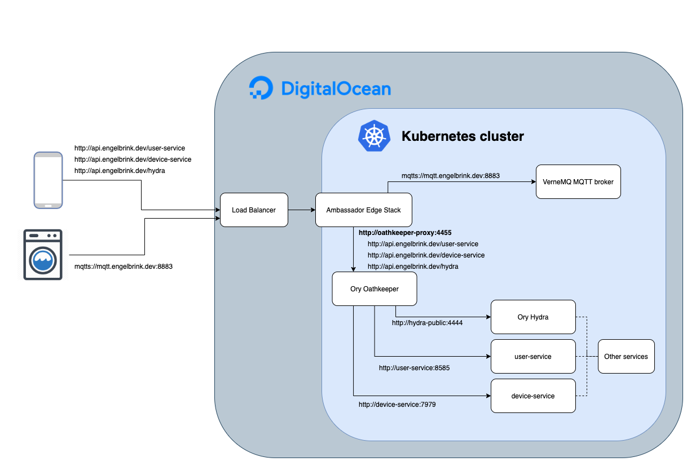

# se09-docs

This repository contains all information about my IoT project for the SE09 module. The project is a base setup for an IoT application where users can control their smart devices via an smartphone app. Furthermore all logs/events from each IoT device are stored into a database.

## List of repos
- [user-service](https://github.com/henrikengelbrink/se09-user-service)
- [cert-service](https://github.com/henrikengelbrink/se09-cert-service)
- [device-service](https://github.com/henrikengelbrink/se09-device-service)
- [infrastructure](https://github.com/henrikengelbrink/se09_infrastructure)
- [user-app](https://github.com/henrikengelbrink/se09-user-app)
- [docker-images](https://github.com/henrikengelbrink/se09-docker-images)
- [hibp-service](https://github.com/henrikengelbrink/se09-hibp-check)
- [iot-device](https://github.com/henrikengelbrink/se09-iot-device)

## Architecture

## Threat modelling

Table of all possible threats/attack vectors can be found here: https://airtable.com/embed/shr0tufoYRPPDTZJf?backgroundColor=red&viewControls=on

<iframe class="airtable-embed" src="https://airtable.com/embed/shr0tufoYRPPDTZJf?backgroundColor=red&viewControls=on" frameborder="0" onmousewheel="" width="100%" height="533" style="background: transparent; border: 1px solid #ccc;"></iframe>

# Kubernetes security
Kubernetes is the biggest container orchestration tool out there and it is used by a lot of companies from small startups to huge enterprise. Nevertheless, the default configuration of Kubernetes is pretty insecure. In the following I will explain possibilities to increase security of Kubernetes.

## Network policies
By default all pods in a namespace can communicate with each other, independent whether it is necessary or not. This is a security issue, because if one pod is vulnerable, it's possible to access all other pods. If we limit the network capabilities to the minimum, we can reduce the impact of one vulnerable pod. I'm blocking [all network connections between pods by default](https://github.com/henrikengelbrink/se09_infrastructure/blob/master/L2_InfrastructureConfig/k8s.tf#L11-L20) and enable them manually where it is necessary. The policies are automatically enforced by Kubernetes on layer 4 of the internal network. The entire configuration of all policies can be found [here](https://github.com/henrikengelbrink/se09_infrastructure/blob/master/L3_Services/network-policies.tf).

## Pod security policies
By default all pods in a Kubernetes cluster can start with root priviledges and as root user, even if it's not neccessary for these pods. If one of these pods is vulnerable, the attacker can get access to the entire k8s cluster. To prevent this, it is possible to define pod security policies for a Kubernetes cluster. These policies define some rules for pods which are started in the cluster, for example it is possible to define that pods cannot start in priviledged mode or as root user. I defined a [simple pod security policy](https://github.com/henrikengelbrink/se09_infrastructure/blob/master/L3_Services/crds/psd.yml) which is preventing pods starting with priviledges or a root user. This is only a simple starting point and there are a lot of possible configurations available, but for the beginning this simple policy already helps to make the cluster more secure.

- https://banzaicloud.com/blog/pod-security-policy/
- https://docs.bitnami.com/kubernetes/how-to/secure-kubernetes-cluster-psp/

## Mutual TLS
By default all the traffic between pods/services is not encrypted. Services meshes are one easy possibility to implement mutual TLS between all services. In general services meshes are adding another layer on top of Kubernetes. There are three bigger solutions for Kubernetes: [Linkerd](https://linkerd.io/), [Consul](https://www.consul.io/) and [Istio](https://istio.io/). All of them offer the possibility to implement mutual TLS, but I decided to use Istio because it also offers other functionalities which will be presented later in this document. 

Setting up Istio to use mutual TLS is pretty easy, you only have to install Istio to the cluster and enable mutual TLS in the config. Istio is setting up Envoy proxies in front of every service and it automatically creates certificates which will be used to terminate the traffic between services within each Envoy proxy.

  

# Network security

## Cloud Firewall
The infrastructure of this project is running on DigitalOcean. Every managed Kubernetes cluster at DigitalOcean comes automatically with an preconfigured Cloud Firewall which automatically blocks traffic for all ports to the Droplets (Nodes/VM's) except the ports which are necessary to run Kubernetes. The firewall is configured in a way that it only allows traffic which comes from the internal private cloud network of all nodes of the cluster. This cloud firewall prevents hacker to directly access any node of the Kubernetes cluster. All incoming traffic from outside is routed through the load balancer which is connected to the Ambassador Edge Stack service any Ory Oathkeeper.

## Ambassador Edge Stack with TLS
The Ambassador Edge Stack is one of many possible solutions for Kubernetes API gateways. Ambassador is a software which is provisioned via Helm chart into the Kubernetes cluster. Ambassador is working as a Kubernetes ingress, this means it define all possible routes into the cluster itself. Internally the managed DigitalOcean cluster spins up a load balancer at DigitalOcean which recievces all the traffic and routes it to the Ambassador service. Ambassador is routing the requests depending on the specific sub-domain the the corresponding service in the Kuberentes cluster. 

Furthemore Ambassador is also terminating TLS. Therefore it is using the cert-manager and Let's Enrypt to autmatically provision and update TLS certificates for all domains. Through TLS the entire communication via HTTPS between the clients and the server is encrypted.

## Ory Oathkeeper
Ory Oathkeeper is a cloud-native identity & access proxy which is written in Go and completely open source. All incoming API requests for the backend (*https://api.engelbrink.dev* ) are routed from Ambassador Edge Stack to Ory Oathkeeper. Based on a [JSON configuration file](https://github.com/henrikengelbrink/se09_infrastructure/blob/master/L3_Services/oathkeeper-rules.json) Ory Oathkeeper routes the traffic to the corresponding service. The configuration file defines each route and furthermore you can configure authentification, authorization and mutators for each route. 

By using Ory Oathkeeper there is only a single point where all the API endpoints are made public and secure. Every new endpoint needs to be explicitly defined in the configuration which eliminates the danger of publishing endpoint accidentially. Furthermore the authentification and authorization only needs to be implemented in Ory Oathkeeper and not in every single service. This reduces complexity and makes it easier to keep an overview of the entire backend and all public routes. The points authentification and authorization will be explained under *Application security* in a more detailed way.

## VPN to restrict access (DB/k8s)

## DNS security

  

# Application security

## OAuth 2.0 Authorization Code Flow with PKSE

## Ory Hydra + user services for tokens

## Authentification through Oathkeeper & Hydra

## Authorization still done in application (Ory Keto for ACL's in the future)

## bcrypt for salted and encrypted passwords

## HIBP service

## SQL injections

## CORS

## CSRF

## XSS

  

# IoT security

## MQTT broker

## Vault PKI / Public-key cryptography

## Encrypted firmware

  

# Mobile security

## iOS keychain

  

# Database security

## Restrict access by IP and user permissions (least priviledge)

## Backups/Recovery

## Fallback during outtages

  

# Monitoring

## Sentry for crash reporting

## Collect logs with the Elastic stack

## Collect metrics with Prometheus

## Traffic management with Kiali

## Auditing for PostgreSQL

  

# Improvements for the future:
- Container scanning

  

# Useful links:
- https://medium.com/@reuvenharrison/an-introduction-to-kubernetes-network-policies-for-security-people-ba92dd4c809d
- https://github.com/ssllabs/research/wiki/SSL-and-TLS-Deployment-Best-Practices
- https://www.nexusgroup.com/how-to-validate-certificates-in-iot-devices-5/
- https://quarkus.io/guides/vault
- https://learn.hashicorp.com/vault/secrets-management/sm-pki-engine
- https://www.hashicorp.com/blog/certificate-management-with-vault/
- https://kubernetes.io/docs/tasks/inject-data-application/distribute-credentials-secure/
- https://www.hashicorp.com/blog/injecting-vault-secrets-into-kubernetes-pods-via-a-sidecar/
- http://medium.com/@dav009/terraform-sane-practices-project-structure-c4347c1bc0f1
- https://www.hivemq.com/blog/mqtt-security-fundamentals-wrap-up/
- https://medium.com/@ScottAmyx/managed-pki-certificates-one-step-at-a-time-toward-securing-the-iot-8b4c539c8ec
- https://cloudinvent.com/blog/howto-hashicorp-vault-ca-pki-deployment/
- https://dev.to/v6/vault-pki-secrets-engine-with-intermediate-signing-authority-hap
- https://medium.com/@sufiyanghori/guide-using-hashicorp-vault-to-manage-pki-and-issue-certificates-e1981e7574e
- http://yet.org/2018/10/vault-pki/
- https://www.davideaversa.it/blog/kotlin-development-in-vscode/
- https://github.com/62726164/bp/tree/master/load
- https://github.com/adewes/have-i-been-bloomed/blob/master/Makefile
- https://github.com/adewes/bloom
- https://developers.shopware.com/developers-guide/csrf-protection
